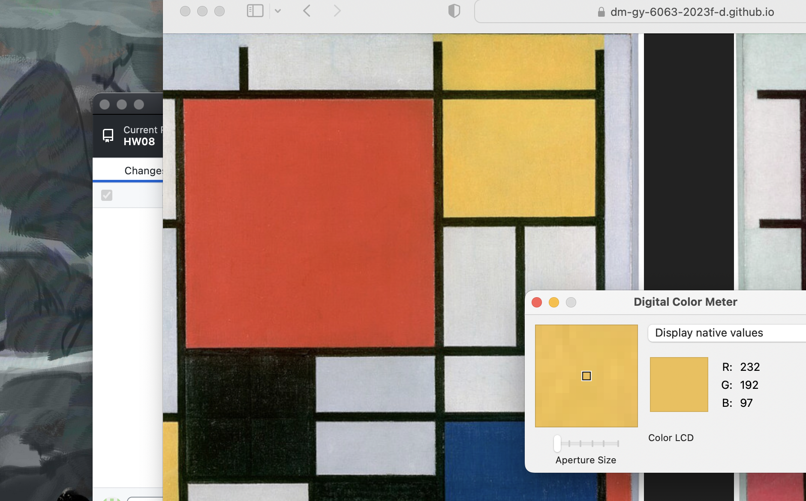
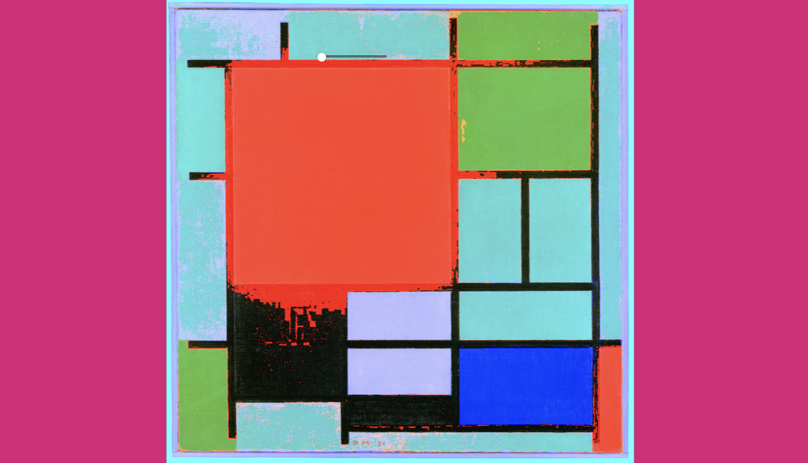

# The basic thinking & Pseudo code
Before completing this week's homework, I began by reviewing the image class code. Though we just changed the colors of RGB in class, I believe there is a way to manipulate yellow. Yellow in RGB is made up of R + G. I can just use a color detector to isolate the yellow part and change its color.   



Also, regarding the DOM element, I'd like to try a simple slider to adjust the pattern or at least color of one of the blocks. Here is my final pseudo code:  
1. Classify color using pixels' information like we did in class
2. Specify color red, green, and yellow using if()
3. Use if() to change red and green to two different colors
4. Use the slider to change yellow to a pattern


# Color classification and specification
When creating color identifications, I can't help but noticed because black colors also has the maximum red, they would be effected. I thought about black color's id (0, 0, 0) and used the color detector to test. I observed the RGB values of black colors to be very low. Thus, I added the condition "&& redVal > 50 (then changed to 70)" to control the spilled effect. Here are before and after: 




I named the parameter absWhite to detect if the color is white. Then, I discarded it and use the absRedGreen and absBlueGreen to detect if the numbers are too close to appear white. Here is what it looks like:


# p5.js Template

This is a README file that can be used to describe and document your assignment.

Markdown Cheatsheet (from [https://www.markdownguide.org/cheat-sheet/](https://www.markdownguide.org/cheat-sheet/)):

---
---

# Heading1
## Heading2
### Heading3
#### Heading4
##### Heading5
###### Heading6

**bold text**

*italicized text*

~~strikethrough text~~

Ordered List:
1. First item
2. Second item
3. Third item

Unordered List:
- First item
- Second item
- Third item

`short code block`

```
extended code block
fun() {
  return 0
}
```

Link:  
[linked text](https://www.example.com)


Image with url:  


Image on repo:  


To start a new line, add two spaces at the end of a line, like this:  
this is a new line.


To start a new paragraph, leave an empty line between two lines of text.

This is a new paragraph.
